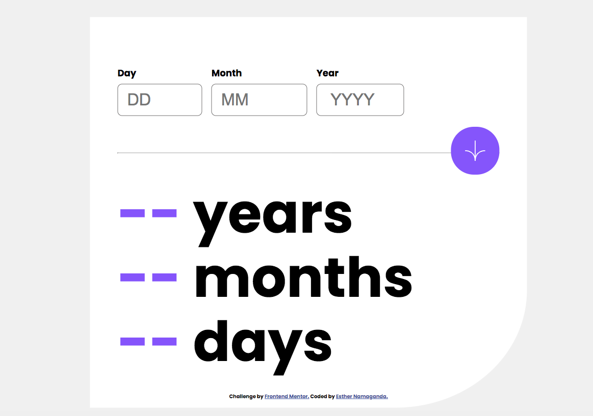

# Frontend Mentor - Age calculator app solution

This is a solution to the [Age calculator app challenge on Frontend Mentor](https://www.frontendmentor.io/challenges/age-calculator-app-dF9DFFpj-Q). Frontend Mentor challenges help you improve your coding skills by building realistic projects. 

## Table of contents

- [Overview](#overview)
  - [The challenge](#the-challenge)
  - [Screenshot](#screenshot)
  - [Links](#links)
- [My process](#my-process)
  - [Built with](#built-with)
  - [What I learned](#what-i-learned)
  - [Continued development](#continued-development)
  - [Useful resources](#useful-resources)
- [Author](#author)
- [Acknowledgments](#acknowledgments)


## Overview

### The challenge

Users should be able to:

- View an age in years, months, and days after submitting a valid date through the form
- Receive validation errors if:
  - Any field is empty when the form is submitted
  - The day number is not between 1-31
  - The month number is not between 1-12
  - The year is in the future
  - The date is invalid e.g. 31/04/1991 (there are 30 days in April)
- View the optimal layout for the interface depending on their device's screen size
- See hover and focus states for all interactive elements on the page
- **Bonus**: See the age numbers animate to their final number when the form is submitted

### Screenshot




### Links

- Solution URL: [Github Account](https://github.com/namaganda-esther/age-calculator-app-frontend_mentor)
- Live Site URL: [Github Pages](https://namaganda-esther.github.io/age-calculator-app-frontend_mentor/)

## My process

### Built with

- Semantic HTML5 markup
- CSS custom properties
- Flexbox
- CSS Grid
- Mobile-first workflow
- [Basic Javascript](https://developer.mozilla.org/en-US/docs/Web/JavaScript) 


### What I learned


```html
<h1><span id="ageYears">--</span> years</h1> 
```
```css
.container{
    width: 100vw;
    height: 100vh;   
}

.content{
    position: absolute;
    top: 20%;
    left: 50%;
    transform: translate(-50%, -20%);
    width: 55vw;
    height: 80vh;
    margin: 40px;
}
input[type=text]{
    padding:20px;
    font-size: 30px;
    text-align: start;
}
```
```js
  var currentDate = new Date();
   var currentDay = currentDate.getDate();
   var currentMonth = currentDate.getMonth() + 1;
   var currentYear = currentDate.getFullYear();

   var ageYears = currentYear - inputYear;
   var ageMonths = currentMonth - inputMonth;
   var ageDays = currentDay - inputDay;


   if (ageDays < 0) {
      ageMonths--;
      var daysInPreviousMonth = new Date(currentYear, currentMonth - 1, 0).getDate();
      ageDays = daysInPreviousMonth + ageDays;
   }

   if (ageMonths < 0) {
      ageYears--;
      ageMonths = 12 + ageMonths;
   }
```


### Continued development

I want to continue learning how Javascript works even more


### Useful resources

- [w3schools](https://www.w3schools.com/) - This helped me with the html, css and javascript. for all entire project
- [Geeks for Geeks](https://www.geeksforgeeks.org/) - This helped me with the html, css and javascript. for all entire project


## Author

- Website - [namaganda-esther](https://github.com/namaganda-esther)
- Frontend Mentor - [@namaganda-esther](https://www.frontendmentor.io/profile/namaganda-esther)
- Twitter - [@prudence_esther](https://www.twitter.com/prudence_esther)


## Acknowledgments

I just want to appreciate myself for being able to finish this project because i almost gave up, i hard issues with media screen.

